# 🌱 CoRise - C2C 쇼핑몰형 서비스 🌱


## 1. 프로젝트 소개

이화여대 학생들을 위한 C2C(Consumer-to-Consumer) 쇼핑몰형 서비스입니다. 따뜻하고 신뢰감 있는 분위기 속에서 안전하게 거래할 수 있는 공간을 제공합니다.

### 💻 Frontend Developers:
- 윤희서
- Tran Thu Trang

### 💻 Backend Developers:
- 박은수
- 강다혜
- 최지수


## 2. 기술 스택

### Frontend


### Backend


## 3. 디렉토리 구조

```text
├── authentication/
├── static/           # 정적 리소스 (CSS, JS, 이미지, 폰트 등)
├── templates/        # Flask HTML 템플릿
├── app.py            # Flask 메인 애플리케이션 엔트리 포인트
├── database.py       # Firebase/DB 연동 로직
├── README.md     
├── LICENSE
```     

## 4. 기술 블로그
[](https://velog.io/@corise/posts)


## 5. 실행 방법

**Step 1. 레포지토리 클론**

   ```bash
   git clone https://github.com/ewha-market/CoRise.git
   cd CoRise
   ```

**Step 2. 가상 환경 설정**

아래 가이드를 참고 👉 [](https://velog.io/@corise/%EA%B0%80%EC%9D%B4%EB%93%9C-Anaconda-Flask-%ED%99%98%EA%B2%BD-%EC%84%A4%EC%A0%95)


**Step 3. 필요 패키지 설치 (Flask, Firebase)**

**Step 4. 서버 실행**
   ```bash
   flask --debug run
   ```


## 6. 구성 화면

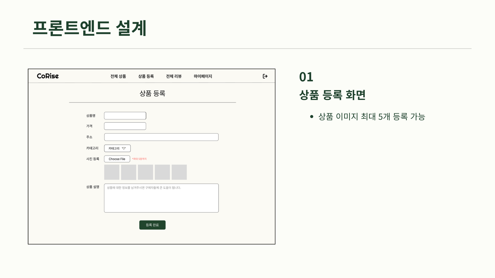

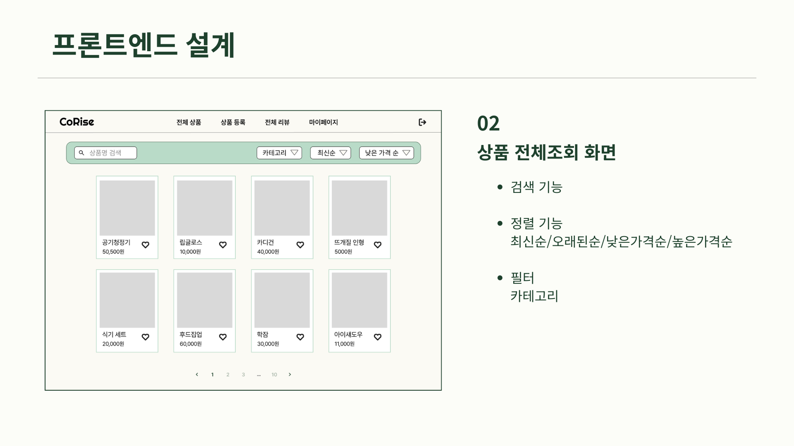

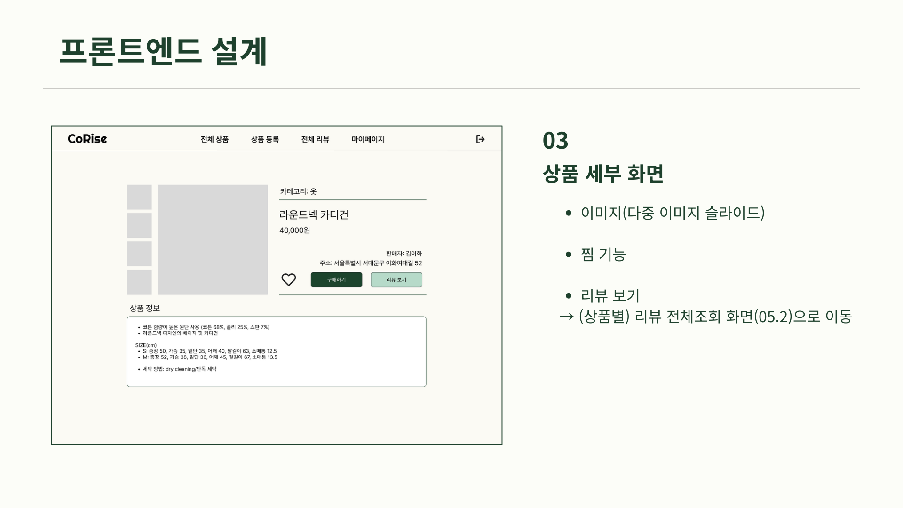

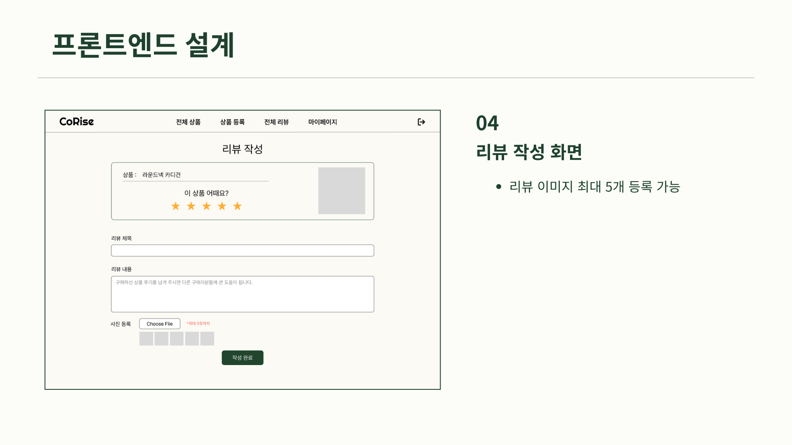

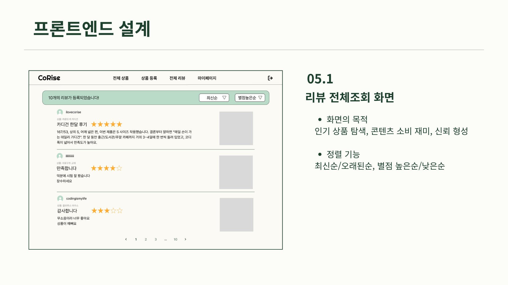


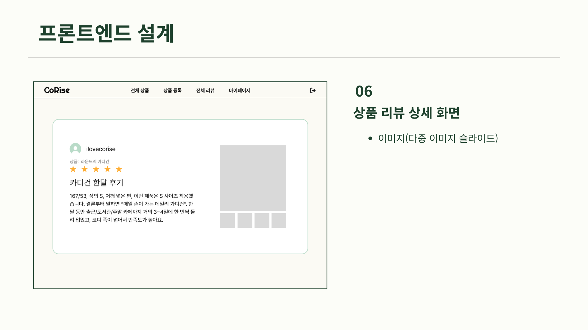

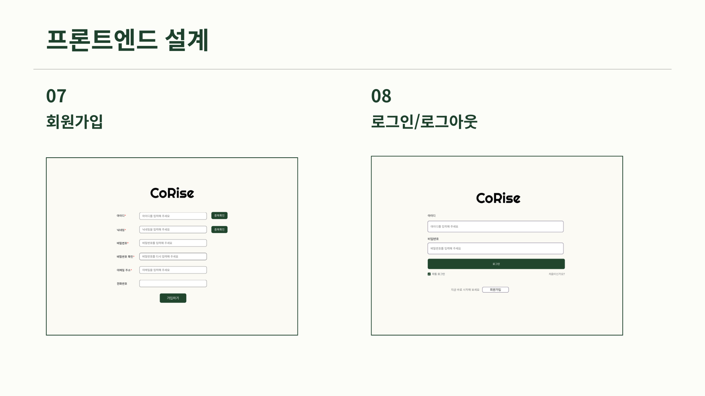

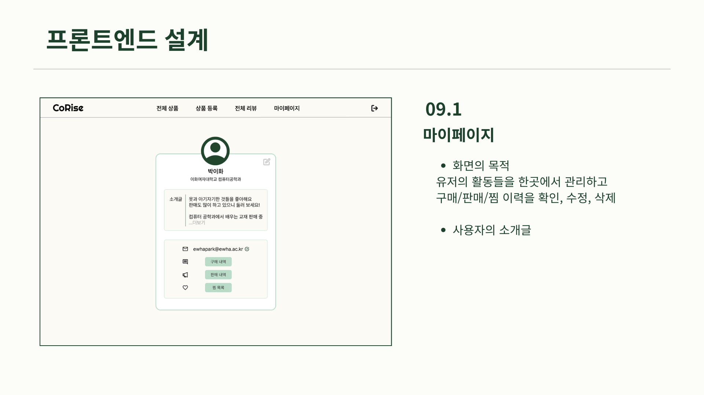

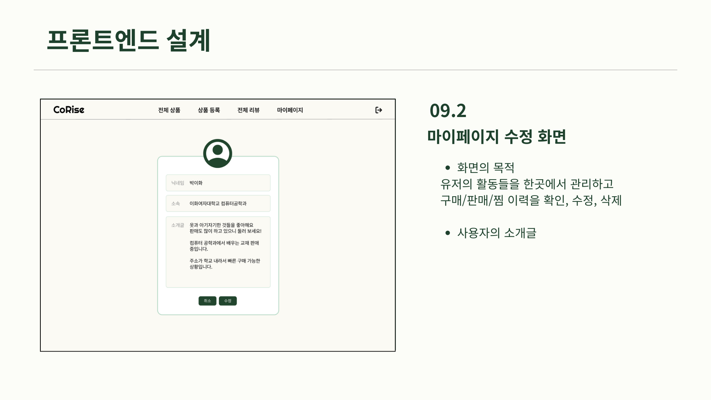

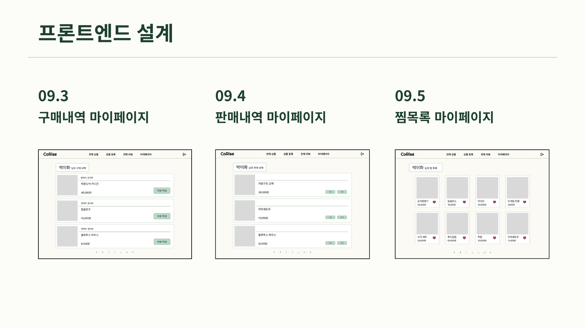

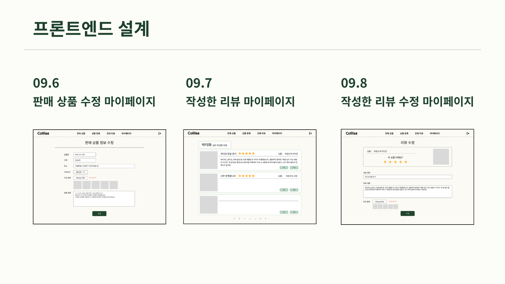